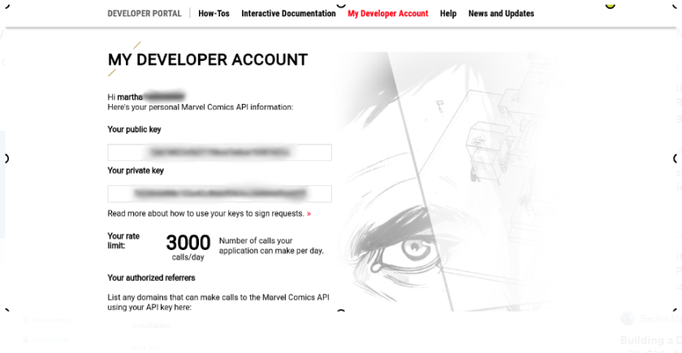
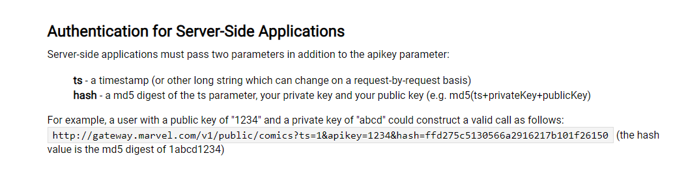

# Consumindo API da Marvel

1. Para utilizar a API é necessário se cadastrar no link: https://developer.marvel.com/
2. Após finalizar voce receberá a sua public key e private key.

3. A forma para se autenticar na API está descrito abaixo.

4. Site para criar o hash: https://blueimp.github.io/JavaScript-MD5/ 